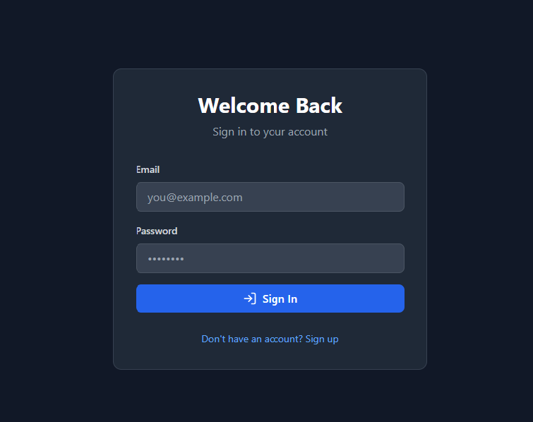
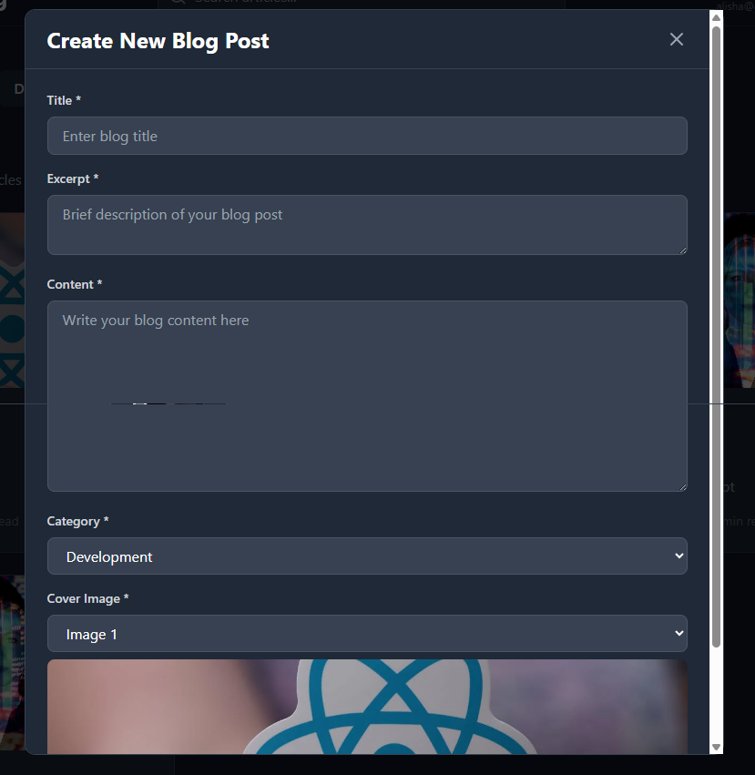
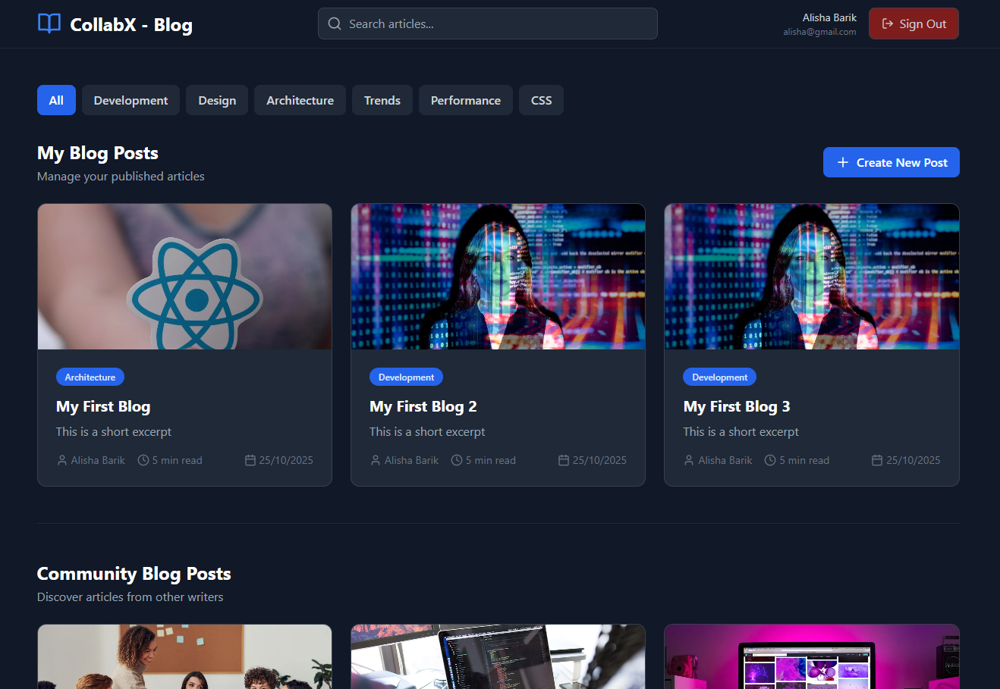

# CollabX Blog

**CollabX Blog** is a modern mini-blog platform designed for easy content creation and management, tailored for developers, designers, and other creators. This web application allows users to sign in, create and manage their blog posts with an intuitive interface, and customize their content with categories and cover images.

## Features

- **User Authentication:** Users can sign in to their accounts using email and password.
- **Create and Manage Posts:** Users can create new blog posts by adding titles, excerpts, and content.
- **Categories & Tags:** Posts can be categorized for easier navigation and filtering (e.g., Development, Design, Architecture).
- **Cover Images:** Users can upload and set a cover image for each blog post.
- **Preview Posts:** A preview of published posts is available, with excerpts and categories displayed.
- **Responsive Design:** The frontend is designed to be responsive and provide a seamless experience across devices.

## Screenshots

### 1. Login Page

The login screen allows users to sign in to their account with their email and password.



### 2. Create New Post

A simple form to create a new blog post, including fields for title, excerpt, content, category, and cover image.



### 3. Dashboard

A user dashboard to manage and view previously published posts, along with options to create new posts.



## Technologies Used

- **Frontend:** HTML, CSS, JavaScript (React.js)
- **Backend:** Not included in this repo (frontend-only)
- **Database:** Not included in this repo (frontend-only)

## Getting Started

To get a local copy up and running, follow these simple steps:

### Prerequisites

- Node.js and npm (Node Package Manager)

### Installation

1. Clone the repo:

```bash
git clone https://github.com/yourusername/collabx-blog.git
```
